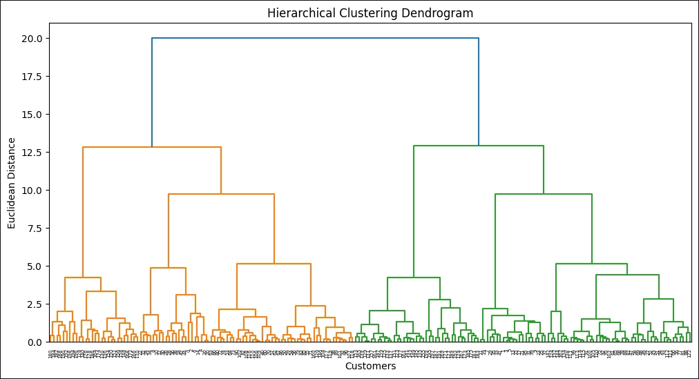

```html

<!DOCTYPE html>

<html lang="en">

<head>

<meta charset="UTF-8">

<meta name="viewport" content="width=device-width, initial-scale=1.0">

<title>Customer Segmentation using HDBSCAN and Unsupervised Machine Learning</title>


<style>


body{

&#x20;   font-family: Arial, sans-serif;

&#x20;   line-height:1.8;

&#x20;   margin:40px;

&#x20;   background:#ffffff;

&#x20;   color:#333;

}


h1{

&#x20;   color:#2563eb;

&#x20;   text-align:center;

}


h2{

&#x20;   color:#1e40af;

&#x20;   border-bottom:2px solid #e5e7eb;

&#x20;   padding-bottom:5px;

}


h3{

&#x20;   color:#374151;

}


table{

&#x20;   width:100%;

&#x20;   border-collapse:collapse;

&#x20;   margin-top:20px;

}


table th{

&#x20;   background:#2563eb;

&#x20;   color:white;

&#x20;   padding:12px;

}


table td{

&#x20;   padding:12px;

&#x20;   border:1px solid #d1d5db;

}


img{

&#x20;   max-width:100%;

&#x20;   border:1px solid #d1d5db;

&#x20;   border-radius:8px;

&#x20;   margin-top:10px;

&#x20;   margin-bottom:20px;

}


.section{

&#x20;   margin-top:40px;

}


.highlight{

&#x20;   background:#eff6ff;

&#x20;   padding:15px;

&#x20;   border-left:5px solid #2563eb;

}


.footer{

&#x20;   text-align:center;

&#x20;   margin-top:60px;

&#x20;   color:#6b7280;

}


</style>


</head>


<body>


<h1>Customer Segmentation using HDBSCAN and Unsupervised Machine Learning</h1>


<div class="section">


<h2>Problem Statement</h2>


<p>

Shopping malls and retail businesses often serve thousands of customers with different purchasing behaviors. Without customer segmentation, all customers appear similar, making it difficult to design effective marketing campaigns.

</p>


<p>

As a result:

</p>


<ul>

<li>Premium customers may not receive exclusive rewards.</li>

<li>Budget-conscious customers may not receive suitable discounts.</li>

<li>High-income customers with low spending may remain under-engaged.</li>

<li>Marketing resources may be wasted on untargeted promotions.</li>

</ul>


<p>

The objective of this project is to automatically identify meaningful customer groups using Unsupervised Machine Learning techniques and generate actionable business insights for targeted marketing.

</p>


</div>


<div class="section">


<h2>Project Overview</h2>


<p>

This project performs customer segmentation on mall customer data using clustering algorithms. The dataset contains customer demographics and spending behavior.

</p>


<ul>

<li>Age</li>

<li>Gender</li>

<li>Annual Income</li>

<li>Spending Score</li>

</ul>


<p>

Multiple clustering algorithms were applied and compared:

</p>


<ul>

<li>K-Means Clustering</li>

<li>Hierarchical Clustering</li>

<li>DBSCAN</li>

<li>HDBSCAN</li>

</ul>


<p>

The quality of clustering was evaluated using:

</p>


<ul>

<li>Elbow Method</li>

<li>Silhouette Score</li>

</ul>


</div>


<div class="section">


<h2>Machine Learning Workflow</h2>


<div class="highlight">


Dataset Collection<br><br>


↓<br><br>


Data Cleaning \& Exploratory Data Analysis<br><br>


↓<br><br>


Feature Selection<br><br>


↓<br><br>


Feature Scaling using StandardScaler<br><br>


↓<br><br>


Elbow Method<br><br>


↓<br><br>


Silhouette Score Analysis<br><br>


↓<br><br>


K-Means Clustering<br><br>


↓<br><br>


Hierarchical Clustering<br><br>


↓<br><br>


DBSCAN<br><br>


↓<br><br>


HDBSCAN<br><br>


↓<br><br>


Customer Segment Profiling<br><br>


↓<br><br>


Business Insights \& Marketing Strategies


</div>


</div>


<div class="section">


<h2>Technologies Used</h2>


<ul>

<li>Python</li>

<li>Pandas</li>

<li>NumPy</li>

<li>Matplotlib</li>

<li>Seaborn</li>

<li>Scikit-Learn</li>

<li>HDBSCAN</li>

<li>K-Means</li>

<li>Hierarchical Clustering</li>

<li>DBSCAN</li>

</ul>


</div>


<div class="section">


<h2>Results \& Visualizations</h2>


<h3>K-Means Clustering</h3>


<p><strong>Silhouette Score:</strong> 0.4284</p>


<hr>


<h3>Hierarchical Clustering</h3>





<p><strong>Silhouette Score:</strong> 0.4201</p>


<hr>


<h3>DBSCAN Clustering</h3>


<p><strong>Silhouette Score:</strong> YOUR\_DBSCAN\_SCORE</p>


<hr>


<h3>HDBSCAN Clustering</h3>


<p><strong>Silhouette Score:</strong> YOUR\_HDBSCAN\_SCORE</p>


<hr>


<h3>Algorithm Comparison</h3>


</div>


<div class="section">


<h2>Customer Segments Identified</h2>


<table>


<tr>

<th>Customer Segment</th>

<th>Characteristics</th>

<th>Business Strategy</th>

</tr>


<tr>

<td><strong>Premium Customers</strong></td>

<td>High Income<br>High Spending</td>

<td>

VIP Memberships<br>

Premium Product Recommendations<br>

Exclusive Rewards

</td>

</tr>


<tr>

<td><strong>High Income Low Spending</strong></td>

<td>High Purchasing Power<br>Low Spending Activity</td>

<td>

Personalized Recommendations<br>

1+1 Offers<br>

Re-engagement Campaigns

</td>

</tr>


<tr>

<td><strong>Loyal Budget Customers</strong></td>

<td>Lower Income<br>High Spending Frequency</td>

<td>

Cashback Programs<br>

Loyalty Rewards<br>

Referral Incentives

</td>

</tr>


<tr>

<td><strong>Budget Customers</strong></td>

<td>Low Income<br>Low Spending</td>

<td>

Discount Coupons<br>

Budget-Friendly Deals<br>

Festival Sales

</td>

</tr>


<tr>

<td><strong>Young Regular Customers</strong></td>

<td>Younger Age Group<br>Moderate Spending</td>

<td>

Trend-Based Promotions<br>

Seasonal Campaigns

</td>

</tr>


<tr>

<td><strong>Older Average Customers</strong></td>

<td>Older Age Group<br>Stable Spending Behaviour</td>

<td>

Family Packages<br>

Membership Benefits

</td>

</tr>


</table>


</div>


<div class="section">


<h2>Business Impact</h2>


<p>

This project demonstrates how customer segmentation can help businesses:

</p>


<ul>

<li>Improve customer targeting</li>

<li>Increase marketing efficiency</li>

<li>Identify premium customers</li>

<li>Improve customer retention</li>

<li>Design personalized campaigns</li>

<li>Increase overall sales and engagement</li>

</ul>


<p>

Instead of treating all customers equally, businesses can make data-driven decisions based on customer behavior patterns.

</p>


</div>


<div class="section">


<h2>Key Learnings</h2>


<ul>

<li>Unsupervised Machine Learning</li>

<li>Customer Analytics</li>

<li>Feature Scaling</li>

<li>K-Means Clustering</li>

<li>Hierarchical Clustering</li>

<li>DBSCAN</li>

<li>HDBSCAN</li>

<li>Silhouette Score Analysis</li>

<li>Business Intelligence</li>

<li>Customer Behaviour Analysis</li>

</ul>


</div>


<div class="footer">


<h3>Author</h3>


<p>

Prathamesh Shelke

</p>


<p>

© 2025 • Customer Segmentation using HDBSCAN and Unsupervised Machine Learning

</p>


</div>


</body>

</html>

```


